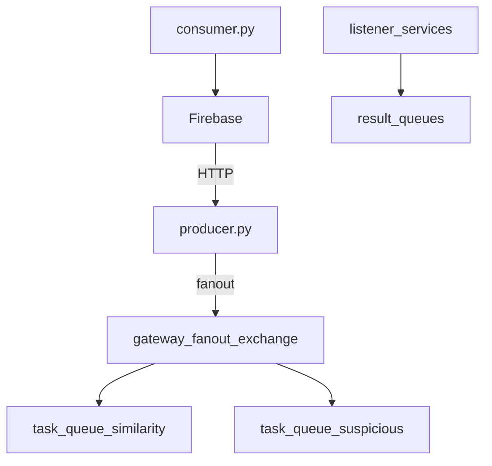

# 🔌 Gateway Service

This component acts as the **central orchestrator** between Firebase and the AI microservices in the Lost & Found platform. It publishes requests to RabbitMQ queues and listens for responses from microservices handling similarity search and suspicious user detection.

---

## 📍 Responsibilities

- Acts as the interface between Firebase backend and the RabbitMQ messaging system.
- Publishes new lost/found item reports and user activity events via RabbitMQ exchanges.
- Listens to result queues for:
  - Similarity search matches
  - Suspicious behavior alerts
- Sends structured responses back to Firebase via REST API (or future pub/sub integration).

---

## 📁 Folder Structure

```
gateway/
├── consumer.py      # Listens to result queues and relays responses to Firebase
├── producer.py      # Publishes messages to RabbitMQ (task queues)
├── config.py        # RabbitMQ connection settings
└── utils.py         # Helper functions (e.g., Firebase updater, logger)
```

---

## 🔄 Message Flow



---

## 🚀 How to Run

### Prerequisites

- RabbitMQ instance running (e.g., Docker)
- Firebase Admin SDK credentials (if response posting is implemented)
- Python ≥ 3.9

### Install dependencies

```bash
pip install -r requirements.txt
```

### Publish a Task

```bash
python producer.py
```

> This simulates an item report or suspicious activity trigger.

### Listen for Results

```bash
python consumer.py
```

> Continuously listens to result queues (`result_similarity_queue` and `result_suspicious_queue`), processes responses, and logs or forwards them.

---

## 📦 Tech Stack

- **Python**
- **RabbitMQ** (`pika` client)
- **FastAPI** (optional for external interfacing)
- **Firebase Admin SDK** (optional for posting to Firestore)

---

## 🔧 Configuration

Make sure your `config.py` contains:

```python
RABBITMQ_HOST = "localhost"
EXCHANGES = {
    "gateway_fanout_exchange": "fanout"
}
QUEUES = {
    "task_queue_similarity": "similarity",
    "task_queue_suspicious": "suspicious",
    "result_similarity_queue": "result.similarity",
    "result_suspicious_queue": "result.suspicious"
}
```

---

## 📬 Example Message (Published to Similarity Queue)

```json
{
  "post_id": "abc123",
  "title": "Black leather wallet",
  "description": "Lost near cafeteria",
  "image_url": "https://example.com/wallet.jpg"
}
```

---

## 📌 Related Repositories

- 🔗 [AI Microservices (Similarity & Fraud)](https://github.com/AchrefHemissi/lostfound-smart_matching-and-fraud_detection-microservices)
- 🧩 [Messaging Infrastructure (Root)](https://github.com/AchrefHemissi/lostfound-messaging-infrastructure)

---

## 🧠 Authors
Developed by the FoundIt team — INSAT 2025
